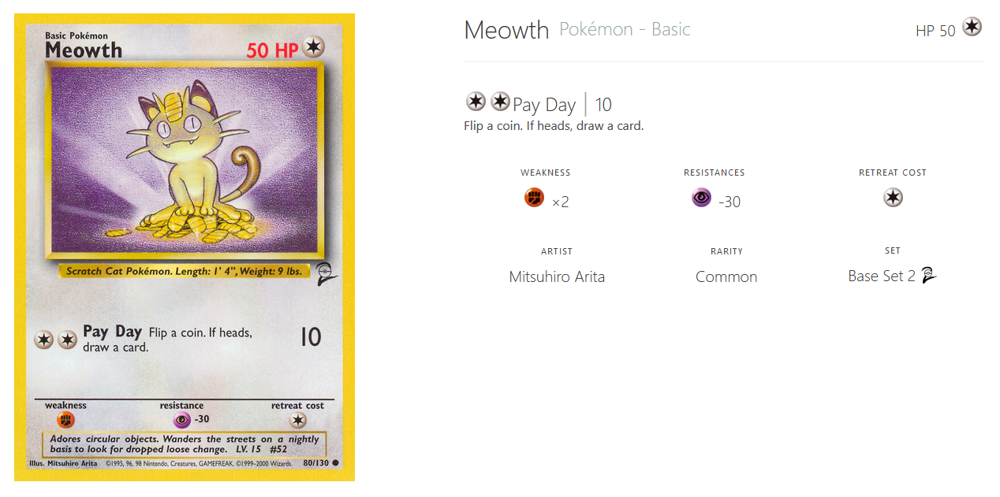

# I Choose You!

Oh No!  Ash’s pokecardex is broken!  Before Ash was a pokemon trainer, he practiced his training knowledge by playing the Pokemon Card game with his friends.  He received a Pokecardex, which was a tool that would take his card info and store his card library and run battle simulations.  Luckily before it died, Ash was able to backup the pokecardex as a json file.  However, the pokecardex is no longer available for mass market sales.  It is your task to help Ash create a new pokecardex tool for him to relive the glory days of his childhood.

## The Pokemon Card Game Overview

The pokemon card game consists of three different types of Pokemon cards:
- Trainer
- Pokemon
- Energy

To simplify the behavior of this game, we'll only be working with Pokemon cards.  A battle takes place based on two cards.  A turn involves:

- selecting a move (if there are multiple)
- attacking your opponent
- calculating the damage which is: `base_damage * opposing_weakness (default 1) - opposing resistence
- subtracting the damage from the opposition's HP

This is done for both sides until a pokemon has reached 0 HP, at which point the pokemon has fainted and a new Pokemon must be selected.  The loser is when their party has been eliminated.  Let's take Meowth for example:



Meowth is a normal type Pokemon that has a start HP of 50, an attack of 10, a weakness to fighting of 2 times, and a resistence to psychic of -30.  If Meowth were to be attacked by a fighting pokemon, the damage to Meowth would be doubled (weakness of 2 times).  If Meowth were to be attackde by a psychic pokemon, it's attack would lose 30 damage points (stopped at 0).

## Inputs

You will be given via a set of json files that will represent sets of pokemon (see `pokemon_party.json` as an example).  Each pokemon is represented using a json object like so:

```json
{
    "artist": "Ken Sugimori",
    "attacks": [
      {
        "convertedEnergyCost": 2,
        "cost": [
          "Colorless",
          "Colorless"
        ],
        "damage": "20",
        "name": "Whirlwind",
        "text": "If your opponent has any Benched Pokemon, he or she chooses 1 of them and switches it with the Defending Pokemon. (Do the damage before switching the Pokemon.)"
      },
      {
        "convertedEnergyCost": 3,
        "cost": [
          "Colorless",
          "Colorless",
          "Colorless"
        ],
        "damage": "",
        "name": "Mirror Move",
        "text": "If Pidgeotto was attacked last turn, do the final result of that attack on Pidgeotto to the Defending Pokemon."
      }
```

`pokemon_master_list.json` contains all of the possible Pokemon that may be selected.

## Template

A templated file has been created for you to use `pokecarddex.py`.

## Outputs

Your task is to create a class that will take place for the pokecardex.  This class will take an optional input for its `__init__` which will be a json file path that represents the pokemon to be prefilled.  This class must have the following attributes/methods:

| name           | attr/meth | description                                                                      |
| -------------- | --------- | -------------------------------------------------------------------------------- |
| `party`        | attr      | A list of `Pokemon` that represents the current party                            |
| `order`        | attr      | A list of `Pokemon` that represents the parties selected fighting order          |
| `set_order`    | method    | Sets the order of the pokemon based on a list of strings for the pokemon names   |
| `battle`       | method    | simulates a battle based on the passed in opposing `PokeCardDex` class's `party` |
| `heal_party`   | method    | heals the party pokemon to their original starting hp                            |
| `add_to_party` | method    | adds a `Pokemon` to the party.  It will be added to the end of the party order   |

In addition to `PokeCardDex` class, the `Pokemon` class will need to be defined.  This class will be used to represent pokemon for the `PokeCardDex` party.  The `Pokemon` class shall have the following attributes/methods:

| name          | attr/meth | description                                                                          |
| ------------- | --------- | ------------------------------------------------------------------------------------ |
| `name`        | attr      | the name of the Pokemon                                                              |
| `hp`          | attr      | the current health points (hp) of the Pokemon                                        |
| `energy_type` | attr      | a string that represents the energy type of the pokemon                              |
| `weakness`    | attr      | a tuple that represents the energy type and stregth of the weakness (if any)         |
| `resiliance`  | attr      | a tuple that represents the energy type and damage offset of the resiliance (if any) |
| `moves`       | attr      | a list of tuples that represent the name and damage of the moves                     |
| `is_fainted`  | attr      | a boolean that represents if the pokemon is at 0 HP                                  |

## Assumptions

The following are some assumptions that you can take when designing this:

- The move energy type is the same as the pokemon.
- There is no "energy cost" to performing a move.
- If the attack requires a coin flip, ignore the actions that are outlined by the coin flip.
- An evolved pokemon card DOES NOT require the stage 1 predecesssor.
- The opposing team always goes first.
- The pokemon name will be unique.
- The pokemon order will be set before performing a battle.
- If the attack damage has a modifier such as `+`, then assume that modifier is null (meaning it has no affect on the damage and can be ignored)
- If the attack damage is empty (most likely due to a more complicated attack) assume a damage of 5 hp.
- Selecting a move for attack is done by interating over the moves sequencially rotating to the beginning after having exhausted all moves.

## Expected Behaviors

In the end, you should have a completed `PokeCardDex` class that when calling battle, will go through a simulation of a card game battle and declare a victor.  The state of the pokemon should be preserved, meaning any damage during the fight doesn't reset once the battle is over.  

## Grading & Unit Testing

Each student will get a different set of pokemon for their party and the challengers party.  Unit testing will be done to make sure that all attributes and methods have been properly implemented.  A battle will be triggered and compared to my implementation.  If the results are different then a deeper analysis of your code will be conducted to make sure the discrepencies are indeed within your code.

The grading will be broken up like so:

| Task/Action                                                                | Points |
| -------------------------------------------------------------------------- | ------ |
| `Pokemon` and `PokeCardDex` are importable (no syntax errors)              | 10     |
| `Pokemon` has all the expected attributes and methods                      | 20     |
| `PokeCardDex` properly instantiates with a json file                       | 20     |
| `PokeCardDex` properly adds pokemon to the party                           | 10     |
| `PokeCardDex` properly sets the order                                      | 10     |
| `PokeCardDex` properly heals all party pokemon to the appropriate start hp | 10     |
| `PokeCardDex` properly simulates a battle                                  | 20     |
